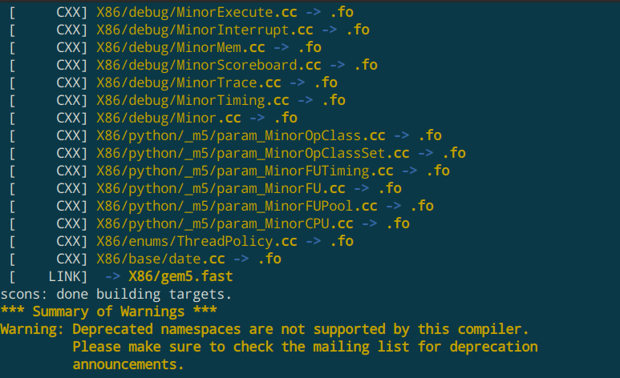
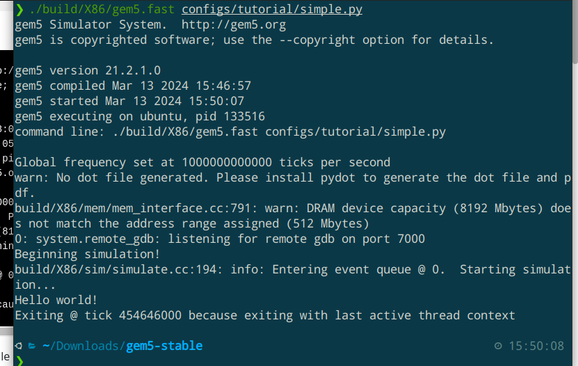
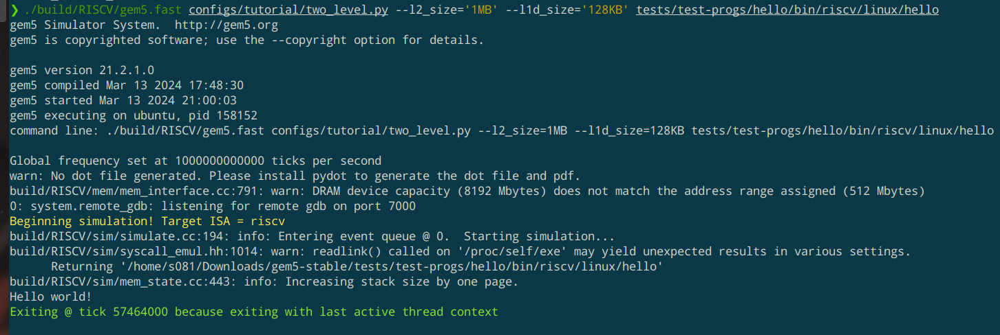

# gem5 学习笔记(随缘更新中)

主要是参考了官方的那个[教程](https://www.gem5.org/documentation/learning_gem5/introduction/)，边看边写一些心得。
目前使用的编译命令：
```
scons build/X86/gem5.fast -j8 CPU_MODELS=AtomicSimpleCPU,TimingSimpleCPU,O3CPU,MinorCPU
```


运行命令：(使用simple.py作为配置文件时)
```
./build/X86/gem5.fast configs/tutorial/simple.py
```


其中gem5.fast中的fast也可以替换成{debug, opt}，这代表了编译的方式：

 - debug：不开启任何的编译优化+去除了所有的调试信息（虽然说是debug模式，但却去除了所有的调试符号，感觉有些奇怪。。。不过先不管了）。编译速度慢
 - opt：开启了-O3编译优化+保留调试信息。编译速度中等
 - fast：开启了更多的编译优化+去除调试信息。编译速度较快

不管哪种方式，编译时间都不会短到哪去，需要一点耐心。官方教程上面用到的是opt模式，我想编译快一些就用了fast，目前运行起来感觉没什么问题。
过程中的一些错误会在最后部分记录。

two_level运行结果：



## 一些概念

### SimObjects
gem5模拟器中的计算机部件都是模块化的，教程上面把这些一个个的部件叫做是**SimObjects**，包括CPU, caches, memory controllers, buses等这些东西。我们要用到哪些部件，都需要手动进行配置。

System和Root这两个SimObjects比较特殊，似乎是所有配置文件中都要出现的，应该可以把它理解成是背景板吧

### ports：

gem5中的每个**内存部件**都具有“端口”这一抽象，端口的类型分为接收（response）和发送（request），我们在声明了内存部件后还需要把他们的端口接入系统。这里需要注意：只有不同类型的端口才能够连接起来。例如我们不能把两个都是接收类型的端口连在一起，那样会触发报错？

只要类型匹配，被连接的两个端口处于等号左右的顺序并不重要。比如我们可以这样连线：
```
system.cpu.icache_port = system.l1_cache.cpu_side
```
也可以这样连线：
```
system.membus.cpu_side_ports = system.cpu.icache_port 
```

### cache
由于历史原因，目前的gem5中有两种cache：**Classic caches**  和**Ruby**，区别貌似是Ruby可以用来测试cache一致性，并且需要我们提供协议的细节。而Classic caches已经内置了一种cache一致性协议。如果我们不想关心协议细节的话就可以选择简化版的Classic caches。未来有把这两套cache系统统一的打算。

我们需要编写自己的cache类，然后让这个类继承**Cache**。这里有大量参数需要我们配置


## 工作流程：
先使用scons编译出gem5模拟器的可执行文件，然后就可以用那个可执行文件来跑模拟程序了。不过在那之前还需要我们提供一个**配置文件**，用来描述我们想要模拟一台怎样的计算机。在那个文件里我们可以列出需要的SimObjects，配置他们的参数以及做连线。
之后每次如果要修改计算机的配置信息，不需要通过重新编译gem5的方式，只要通过改变配置文件就可以了。
在configs/examples下面提供了一些模板可供参考，但是复杂度都比较高，而且对于我这种没有学过python的人更是不友好。。。官方的教程比较用户友好，他会从最简单的脚本开始讲解。

## 运行模式
gem5有两种运行模式：

### 全系统(Full System, FS)：
模拟整个计算机的硬件系统，各种设备的配置信息都需要自己亲自指明，所以配置文件写起来会比较麻烦。当我们需要做一些比较细致的工作时会采用这种方式，适合重度使用

### 系统调用(Syscall Emulation, SE):
主要只模拟CPU和内存系统，配置起来容易一些。当我们不想关心太多的硬件细节，只想用gem5来做一些轻度的使用时就可以用这种运行模式

## 配置文件的编写


在simple.py中描述了上面这个结构图。教程上面写得比较详细，推荐去看那个。后面还有进阶的配置信息。感觉这个文件有点像是verilog的top模块
### 参数传递
可以通过在Options.py中添加自定义的参数解析（183行），然后在se.py中通过args.xxx来访问那个参数。具体可以参考lab2

## 修改GEM5源代码
todo

## 数据统计


## 装环境遇到的一些问题：

 1. 缺少png.h头文件

解决方法：
```
sudo apt-get install libpng-dev
```
但是安装后再去编译还是同样的报错，试了几次都不行。后来发现貌似要把编译出来的文件全部删掉重新编译。
文档的后面也有提到，用的是这两个命令：
```
python3 `which scons` --clean --no-cache # cleaning the build folder
rm -rf build/ # completely removing the gem5 build folder
```
然后再重新编译就没问题了

2. name 't' is not defined

```
scons: Reading SConscript files ...
NameError: name 't' is not defined:
  File "xxxx/gem5-stable/SConstruct", line 219:
    this_build_root, variant = parse_build_path(t)
  File "xxxx/gem5-stable/site_scons/gem5_scons/__init__.py", line 239:
    error("No non-leaf 'build' dir found on target path.", t)
```
这个问题我不知道大家有没有遇到过，其实是比较蠢的一个问题。因为在官方教程上面，**编译**gem5的时候用到了一个**build/X86/gem5.opt**的参数，**运行**gem5的时候也用到了这个参数。然后第一步用到了scons这个工具，所以我在第二步的运行里也加上了scons，就导致了上面的错误。其实这个参数两次出现的意义是不同的，第一次是指定生成的文件名，第二步就是直接运行那个可执行程序了，不用再调用scons

 3. 版本问题：

lab仓库中提供的gem5版本可能较低(21.2.1.0)，导致对最新教程上面的一些语法并不支持。比如教程上实例化cpu用的是：
``system.cpu = X86TimingSimpleCPU()``

而lab仓库中的gem5就不支持这种写法，运行起来会报错说没有X86TimingSimpleCPU这个东西。后来我发现老版里面用到的名字好像是TimingSimpleCPU。那该怎么模拟不同的指令集呢？这个貌似是在编译的时候指定的。比如一开始用到的命令：
```
scons build/X86/gem5.fast -j8 CPU_MODELS=AtomicSimpleCPU,TimingSimpleCPU,O3CPU,MinorCPU
```
这会在build/X86目录下生成可执行程序，并且自动会是x86架构的。要是想生成riscv，可以使用以下的编译命令：
```
scons build/RISCV/gem5.fast -j8 CPU_MODELS=AtomicSimpleCPU,TimingSimpleCPU,O3CPU,MinorCPU
```
然后生成文件的目录也会不同，运行的时候需要注意
这里我也有一个猜想：github上面新版的gem5编译时间非常久，可能是因为他编译一次就能够支持所有的ISA？

4. 其他

编译时间较长，而且占用资源较多。如果虚拟机的运行内存不足也会编译失败。我电脑配置还行，以fast模式编译x86的时候也花了十几分钟。riscv的编译时间还要更久一些