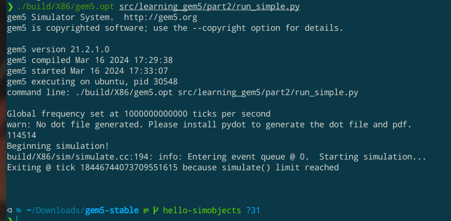

# StackEdit中文版
StackEdit中文版默认空间

官方地址：https://stackedit.cn
开源地址：https://gitee.com/mafgwo/stackeditgem5 学习笔记(随缘更新中)

主要是参考了官方的那个[教程](https://www.gem5.org/documentation/learning_gem5/introduction/)，边看边写一些心得。
目前使用的编译命令：
```
scons build/X86/gem5.fast -j8
```


运行命令：(使用simple.py作为配置文件时)
```
./build/X86/gem5.fast configs/tutorial/simple.py
```


其中gem5.fast中的fast也可以替换成{debug, opt}，这代表了编译的方式：

 - debug：不开启任何的编译优化+去除了所有的调试信息（用于在我们每次修改gem5的源码后重新编译，观察上次的修改是否产生了效果）。编译速度慢
 - opt：开启了-O3编译优化+保留调试信息。编译速度中等
 - fast：开启了更多的编译优化+去除调试信息。编译速度快

不过其实三种方法的编译速度也都快不到哪去，所以需要一些耐心。官方教程上面用到的是opt模式，我想编译快一些就用了fast，目前运行起来感觉没什么问题。
过程中的一些错误会在最后部分记录。

two_level运行结果：


## 一些概念

### SimObjects
gem5模拟器中的计算机部件都是模块化的，教程上面把这些一个个的部件叫做是**SimObjects**，包括CPU, caches, memory controllers, buses等这些东西。我们要用到哪些部件，都需要手动进行配置。

System和Root这两个SimObjects比较特殊，有点算是背景板。如果想做一些实际的配置的话基本上离不开这两个SimObjects

### Memory Objects
#### ports：

gem5中的每个**内存部件**都具有“端口”这一抽象，端口的类型分为接收（response）和发送（request），我们在声明了内存部件后还需要把他们的端口接入系统。这里需要注意：只有不同类型的端口才能够连接起来。

只要类型匹配，被连接的两个端口处于等号左右的顺序并不重要。比如我们可以这样连线：
```
system.cpu.icache_port = system.l1_cache.cpu_side
```
也可以这样连线：
```
system.membus.cpu_side_ports = system.cpu.icache_port 
```

#### cache
由于历史原因，目前的gem5中有两种cache：**Classic caches**  和**Ruby**，区别貌似是Ruby可以用来测试cache一致性，并且需要我们提供协议的细节。而Classic caches已经内置了一种cache一致性协议。如果我们不想关心协议细节的话就可以选择简化版的Classic caches。文档上面说未来有把这两套cache系统统一的打算。

我们可以用内置脚本中提供的cache，也可以编写自己的cache类，替换策略，参数什么的都可以配置。然后让这个类继承**Cache**。lab3里面会有相关内容

#### Packets
内存部件的端口之间通过互发**数据包**的方式来通信。

todo


## 工作流程：
先使用scons编译出gem5模拟器的可执行文件，然后就可以用那个可执行文件来跑模拟程序了。不过在那之前还需要我们提供一个**配置文件**，用来描述我们想要模拟一台怎样的计算机。在那个文件里我们可以列出需要的SimObjects，配置他们的参数以及做连线。
之后每次如果要修改计算机的配置信息，不需要通过重新编译gem5的方式，只要通过改变配置文件就可以了。每次启动gem5的时候他会读取这个配置文件，然后自动对后面的工作作出相应的调整。
在configs/examples下面提供了一些模板可以直接使用，虽然代码看上去有些复杂但感觉好像不怎么影响使用，可以直接拿来用，还挺方便的，可以直接在上面做一些修改。或者也可以自己编写配置文件，官方的教程上面有教怎么编写。
使用其中的se.py这个文件会让gem5以syscall emulation的模式启动，并且支持大量的配置选项，感觉用起来挺方便的。对应的fs.py则配置好了full system模式的参数，使用他们可以省下我们不少的工作

这里有个比较奇特的点是src/下的所有文件都会被编译进最终的可执行文件里面，包括里面那些python文件。所以如果我们修改了一些python文件后，重新启动gem5并不会产生有什么区别，需要重新编译过。
但是配置文件及其相关的一些文件都是可以随便修改的。即改即生效

## 运行模式
gem5有两种运行模式，对用的配置文件分别是fs.py和se.py

### 全系统(Full System, FS)：
模拟整个计算机的硬件系统，各种设备的配置信息都需要自己亲自指明，所以配置文件写起来会比较麻烦。当我们需要做一些比较细致的工作时会采用这种方式，适合重度使用

### 系统调用(Syscall Emulation, SE):
主要只模拟CPU和内存系统，配置起来容易一些。当我们不想关心太多的硬件细节，只想用gem5来做一些轻度的使用时就可以用这种运行模式

## 官方配置文件的使用

目前我主要使用的是**se.py**，所以就记录一些对这个文件的理解。这个文件是主要的配置文件，而且他还会调用很多其他的辅助文件。

首先一开始有一个get_process函数，这个代码写的有点多不过感觉意思还是比较明显，就是在解析命令行参数，获得要执行的二进制文件。然后这里还做了多处理器的支持，似乎可以执行多个二进制文件
### 命令行参数的解析

在119行附近声明了3个变量用来解析命令行参数，
```
parser = argparse.ArgumentParser()
Options.addCommonOptions(parser)
Options.addSEOptions(parser)
```
Options这个类定义在configs/common/Options.py里面，里面列出了所有支持的参数。我们也可以仿照它的代码往里面添加一些自定义的选项。
然后在126行附近，通过：
```
args = parser.parse_args()
```
解析了传入的所有参数，并把参数的值保存到了args这个变量中。所有在Options.py中定义过的参数都会成为args的成员，例如Options.py的第147行定义了---l1d_size这个参数，于是我们可以在se.py中通过args.l1d_size来访问它。

### 怎么使配置生效

在se.py的158行附近有一句：
```
(CPUClass, test_mem_mode, FutureClass) = Simulation.setCPUClass(args)
```
这行代码主要应该是对我们的cpu_type做了一些初始化。例如决定采用的是DerivO3CPU，TimingSimpleCPU或者是别的。那个函数在选出使用的CPU后还紧接着做了一些针对性的初始化。
然后se.py的后面也还有很多做配置的代码。类似于system.xxx = args.xxx这样的代码

如果想把自定义的配置也加入到这个初始化过程，我们可能需要了解system和cpu这两个类里面有哪些成员。然后可以通过像是cpu.xxx = args.xxx这样的办法来实现。


## 数据统计
todo

## 修改GEM5源代码

### 添加自己的SimObject

 1.为这个simObjects 创建一个python文件(类)
 
这个py类是对c++类的包装。
文件的创建位置似乎随意。教程里用的是src/learning_gem5/part2这个目录。
这个py类需要继承SimObject，并且里面需要声明3个重要参数：

 - type：我们希望包装的那个c++类名
 - cxx_header：对应的c++类的头文件路径。如果使用相对路径的话，似乎是相对于src目录
 - cxx_class：使用c++的命名空间的方式指出那个类的名字，和type似乎差不多？

```
from m5.params import *
from m5.SimObject import SimObject

class HelloObject(SimObject): 
	type = 'HelloObject'
	cxx_header = "learning_gem5/part2/hello_object.hh"
	cxx_class = "gem5::HelloObject"
	# 其它自定义参数，可以在c++端使用
	time_to_wait = Param.Latency("Time before firing the event")
	foo = Param.Int(114514, "test")
```

在这个py文件里还可以通过Param来声明一些参数，然后c++端的代码可以到访问这些参数。

 2. 编写simObjects的c++文件

包含头文件(cxx_header)和源文件(cxx_class)。
编写c++端代码时，很多类的成员函数都包含了一个叫做params的参数，可以使用他来访问那些在.py中定义的变量。例如
```
HelloObject::HelloObject(const HelloObjectParams &params) :
	SimObject(params)
{
	std::cout << params.foo << std::endl;
}
```
所有的文件都要包含在namespace gem5里面。官方教程上没有这么写，会导致编译错误，而且GoodbyeObject构造函数的函数签名也有错误，应该改成：
```
GoodbyeObject(const GoodbyeObjectParams &p);
```
 3. 向编译系统“注册”这些py和c++文件

gem5使用scons来做软件的构建，我们要做的就是在之前编写了自定义simObjects的目录下再编写一个**SConscript**，实例：
```
Import('*')

SimObject('HelloObject.py', sim_objects=['HelloObject'])
Source('hello_object.cc')
```
并且其本质上也是一个python文件，支持python各种语法。不过好像也用不到那么多语法

 4. 重新编译gem5

```
scons build/X86/gem5.{mode} -jx
```

 5. 在启动gem5的那个配置脚本里使用我们编写的simObjects

编写一个简单的启动脚本：
```
import m5
from m5.objects import *

root = Root(full_system = False)

# make sure that it is a child of the root object. Only SimObjects
# that are children of the Root object are instantiated in C++.

root.hello = HelloObject() # 这里会调用c++的构造函数，执行里面相应代码的

m5.instantiate()
print("Beginning simulation!")

exit_event = m5.simulate()
print('Exiting @ tick {} because {}'.format(
		m5.curTick(), 	
		exit_event.getCause()))
```
所有的simObjects都需要被挂载到root这个变量的下面后才会被实例化

运行效果：


## 装环境遇到的一些问题：

 1. 缺少png.h头文件

解决方法：
```
sudo apt-get install libpng-dev
```
但是安装后再去编译还是同样的报错，试了几次都不行。后来发现貌似要把编译出来的文件全部删掉重新编译。
```
rm -rf build/
```
然后再重新编译就没问题了

2. name 't' is not defined

```
scons: Reading SConscript files ...
NameError: name 't' is not defined:
  File "xxxx/gem5-stable/SConstruct", line 219:
    this_build_root, variant = parse_build_path(t)
  File "xxxx/gem5-stable/site_scons/gem5_scons/__init__.py", line 239:
    error("No non-leaf 'build' dir found on target path.", t)
```
这个问题我不知道大家有没有遇到过，其实是比较蠢的一个问题。因为在官方教程上面，**编译**gem5的时候用到了一个**build/X86/gem5.opt**的参数，**运行**gem5的时候也用到了这个参数。然后第一步用到了scons这个工具，所以我在第二步的运行里也加上了scons，就导致了上面的错误。其实这个参数两次出现的意义是不同的，第一次是指定生成的文件名，第二步就是直接运行那个可执行程序了，不用再调用scons
[图片上传中...(image-avEdciYr0F4iieE6)]
 3. 版本问题：

lab仓库中提供的gem5版本可能较低(21.2.1.0)，导致对最新教程上面的一些语法并不支持。比如教程上实例化cpu用的是：
``system.cpu = X86TimingSimpleCPU()``

而lab仓库中的gem5就不支持这种写法，运行起来会报错说没有X86TimingSimpleCPU这个东西。后来我发现老版里面用到的名字好像是TimingSimpleCPU。那该怎么模拟不同的指令集呢？这个貌似是在编译的时候指定的。比如一开始用到的命令：
```
scons build/X86/gem5.fast -j8 CPU_MODELS=AtomicSimpleCPU,TimingSimpleCPU,O3CPU,MinorCPU
```
这会在build/X86目录下生成可执行程序，并且自动会是x86架构的。要是想生成riscv，可以使用以下的编译命令：
```
scons build/RISCV/gem5.fast -j8 CPU_MODELS=AtomicSimpleCPU,TimingSimpleCPU,O3CPU,MinorCPU
```
然后生成文件的目录也会不同，运行的时候需要注意
这里我也有一个猜想：github上面新版的gem5编译时间非常久，可能是因为他编译一次就能够支持所有的ISA？

4. 其他

编译时间较长，而且占用资源较多。如果虚拟机的运行内存不足也会导致编译失败。（前面的编译过程全部正常，但最后的链接步骤容易失败）